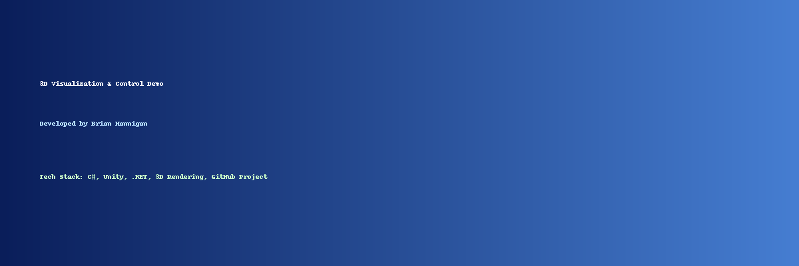

<!-- Banner -->


# 3D Visualization & Control Demo
A real-time visualization and control system demonstrating modular 3D rendering, data interaction, and user input control built in **C#** and **Unity**.

[](LICENSE)


---

## 🧭 Overview
This project illustrates the principles of real-time 3D visualization and interactive control systems using **C#/.NET** and the **Unity Engine**.  
It’s designed to showcase code structure, object-oriented design, and rendering logic typical of simulation and visualization software.

---

## 🧩 Features
- Load and render STL or mesh-based geometry
- Real-time orbit, zoom, and pan camera controls
- Modular component architecture in C#
- Frame-rate and performance diagnostics
- Clean separation between rendering and logic layers
- Extensible framework for adding new data sources or geometry types

---

## 📁 Folder Structure
```
/3DVisualizationDemo
 ├─ Assets/
 │   ├─ Scripts/
 │   │   ├─ STLImporter.cs
 │   │   ├─ CameraController.cs
 │   │   ├─ ObjectManager.cs
 │   ├─ Models/
 │   │   └─ sample.stl
 │   ├─ Scenes/
 │       └─ Main.unity
 ├─ README.md
 ├─ LICENSE
 └─ 3DVisualizationDemo_Banner.png
```

---

## ⚙️ Code Example

**STLImporter.cs**
```csharp
public Mesh ImportSTL(string filePath)
{
    var mesh = new Mesh();
    using (var reader = new BinaryReader(File.Open(filePath, FileMode.Open)))
    {
        reader.ReadBytes(80);
        uint triangles = reader.ReadUInt32();
        Vector3[] verts = new Vector3[triangles * 3];
        int[] indices = new int[triangles * 3];

        for (int i = 0; i < triangles; i++)
        {
            reader.ReadBytes(12);
            for (int v = 0; v < 3; v++)
            {
                float x = reader.ReadSingle();
                float y = reader.ReadSingle();
                float z = reader.ReadSingle();
                verts[i * 3 + v] = new Vector3(x, y, z);
                indices[i * 3 + v] = i * 3 + v;
            }
            reader.ReadUInt16();
        }

        mesh.vertices = verts;
        mesh.triangles = indices;
        mesh.RecalculateNormals();
    }
    return mesh;
}
```

---

## 🕹️ Usage
1. Open the Unity project folder.  
2. Run the `Main.unity` scene.  
3. Load the sample STL model via the inspector or a runtime file picker.  
4. Use your mouse to rotate, zoom, and pan around the model.  

---

## 🧠 Technical Concepts
| Area | Focus | Example |
|------|--------|----------|
| **Rendering** | Real-time mesh creation and lighting | C# Mesh API |
| **Interaction** | Orbit camera controls, input mapping | Input.GetAxis |
| **Architecture** | Object-oriented design, modular scripts | STLImporter, CameraController |
| **Performance** | Efficient geometry parsing | BinaryReader |
| **Portability** | Cross-platform Unity/.NET environment | Tested on Windows and Linux |

---

## 🧑‍💻 Author
**Brian Hannigan**  
InfraGard Member • CompTIA Security+ • Unreal Educator Accelerator  
[LinkedIn](https://linkedin.com/in/brianjhannigan)

---

## 🪪 License
This project is licensed under the **MIT License** — see the [LICENSE](LICENSE) file for details.
